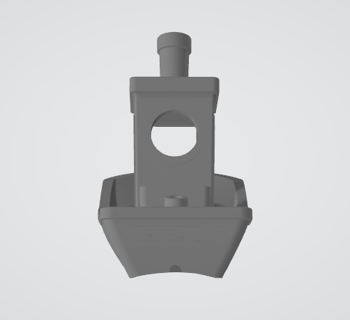
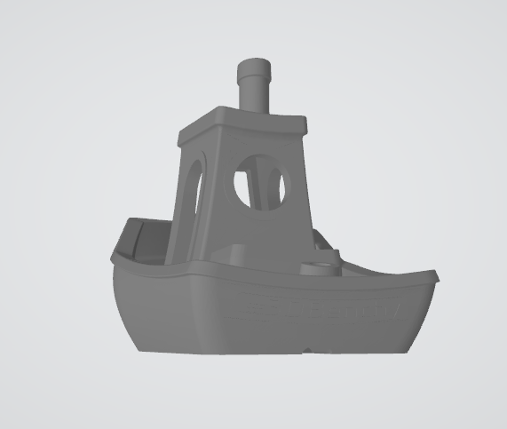
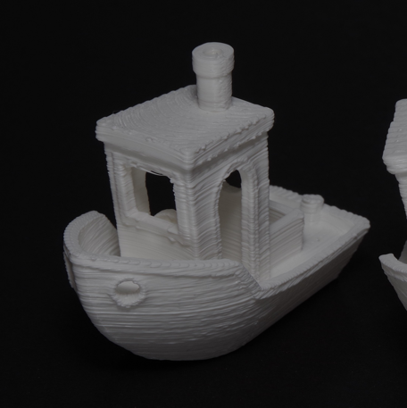
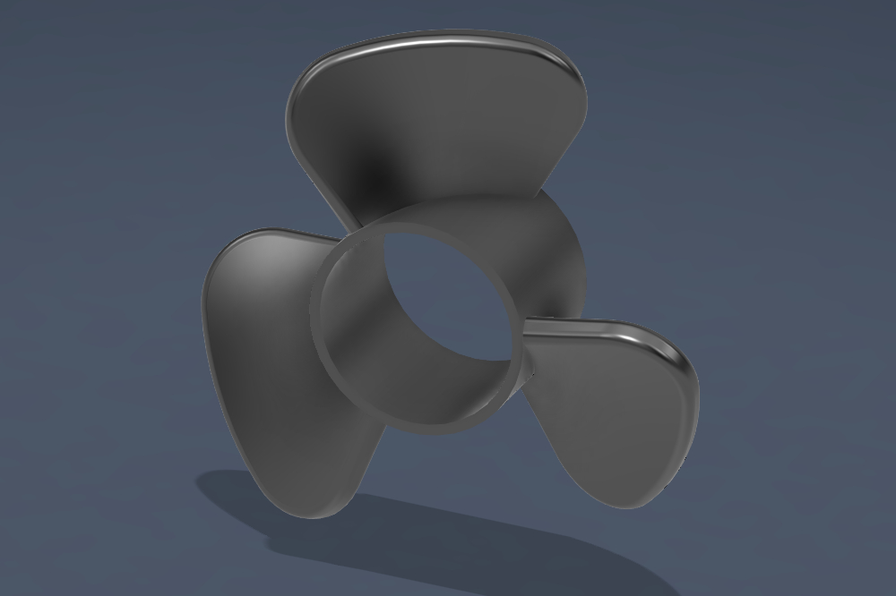
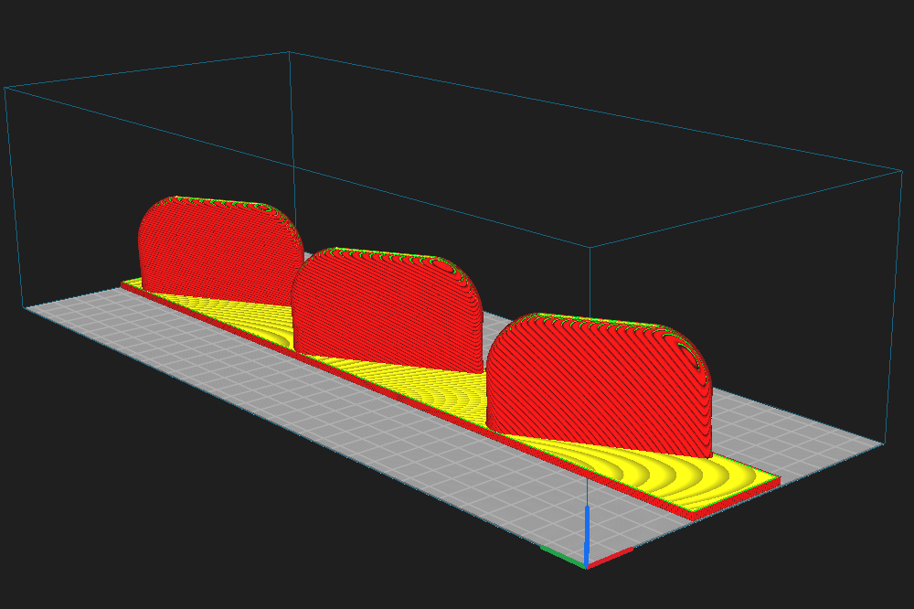

# Cura Slicer to Cylindrical Conversion

Method for generating G-code for a cylindrical 3D printer using a standard slicer. Works by geometrically flattening a model designed for a cylinder into a Cartesian STL that any slicer can handle, then correcting the extrusion values in post-processing.

> **Note:** This is a working but imperfect method. Dimensional accuracy is good, but there is no topological continuity for fully rotational objects. The [FullControl-based approach](../FullcontrollXYZ%20preview/) generates paths natively in cylindrical coordinates and may be preferable for some geometries.

---

## Workflow

### Step 1 — Prepare the model

Start with a standard 3D model. Cut or adapt it so it can be placed on the surface of the cylinder (drum). The model's geometry should be wrapped around the drum radius before the next step.



### Step 2 — Flatten the STL

Run `cylindrical_to_cartesian.py` to unroll the cylindrical geometry into a flat Cartesian STL that a standard slicer can process:

```bash
python cylindrical_to_cartesian.py <input.stl> [output.stl] [drum_radius_mm] [cut_angle_deg]
```

| Parameter | Default | Description |
|-----------|---------|-------------|
| `drum_radius_mm` | 28.5 (57 mm diameter) | Radius of the print drum |
| `cut_angle_deg` | 180° | Where the seam is placed (0° = +Z, 180° = −Z) |

The output STL can be very large due to triangle subdivision — the sample file includes a `_flattened_decimated.stl` version decimated in Blender to reduce file size. Use the non-decimated version for actual slicing.



### Step 3 — Slice in Cura

Import the flattened STL into Cura using the **Custom Cylindrical** printer profile from the [cura_profile](cura_profile/) folder.

To install the profile: copy the contents of `cura_profile/` into your Cura user data directory:
- Windows: `%AppData%\Roaming\cura\<version>\`

The profile sets:
- Build volume: 150 × 361 × 100 mm (X: linear travel, Y: rotation in degrees, Z: height)
- Start G-code with homing, Y-axis zero reset, and a purge line
- End G-code with Z lift and motor disable

Slice normally. Export the `.gcode` file.

### Step 4 — Recalculate extrusion

The slicer calculates extrusion based on flat Cartesian distances. Since the actual print path follows an arc, extrusion must be corrected:

```bash
python recalculate_extrusion.py <input.gcode> [output.gcode] [drum_radius_mm]
```

| Parameter | Default | Description |
|-----------|---------|-------------|
| `drum_radius_mm` | 28 (56 mm diameter) | Radius of the print drum — **must match Step 2** |

> Make sure `drum_radius_mm` is consistent between both scripts.

The script outputs a `_corrected.gcode` file with adjusted extrusion values. Send this file to the printer.



The printed Benchy is functionally equivalent to one printed on a standard FDM printer. The main differences are a rounded bottom (conforming to the drum surface instead of sitting flat) and radial bridges, which may exhibit more sagging than on a flat-bed printer. Print quality is lower than a standard printer as this is a prototype, though the result is fully functional.

This example highlights the limitations of adapting flat-bed models to cylindrical printing. To fully leverage this geometry, models should be designed specifically for cylindrical printing — eliminating the rounded-bottom and bridge issues entirely. It is also possible to print unmodified files directly without the flattening step, as shown in the propeller example below.

### Propeller — geometry designed for cylindrical printing

The propeller was designed with cylindrical printing in mind and printed directly without adaptation. This avoids the compromises seen in the Benchy example.






---

## Files

| File / Folder | Description |
|---------------|-------------|
| [cylindrical_to_cartesian.py](cylindrical_to_cartesian.py) | Flattens cylindrical STL to Cartesian |
| [recalculate_extrusion.py](recalculate_extrusion.py) | Corrects extrusion in sliced G-code |
| [cura_profile/](cura_profile/) | Cura printer profile for Custom Cylindrical |
| [sample gcode/](sample%20gcode/) | Sample files for each step of the workflow |
