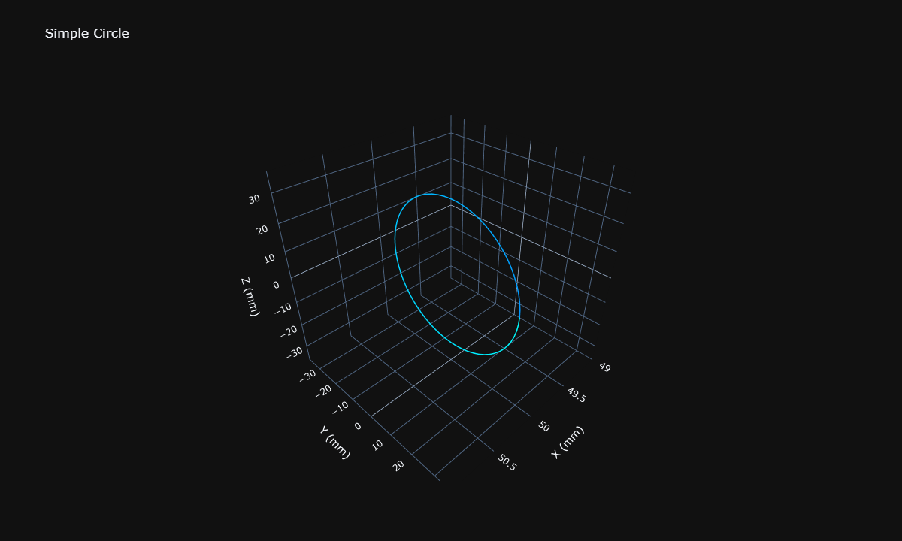
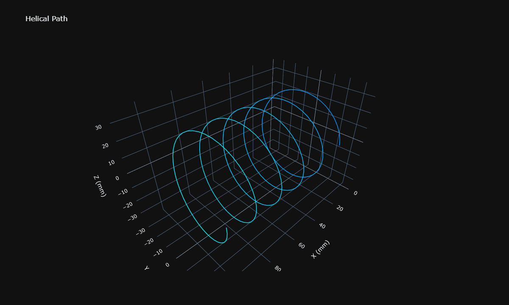
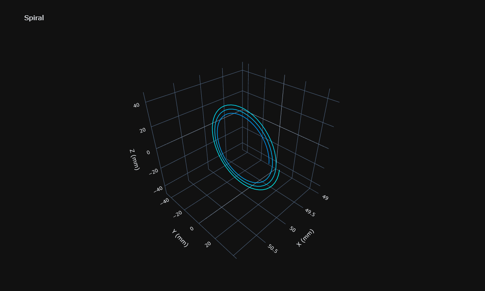
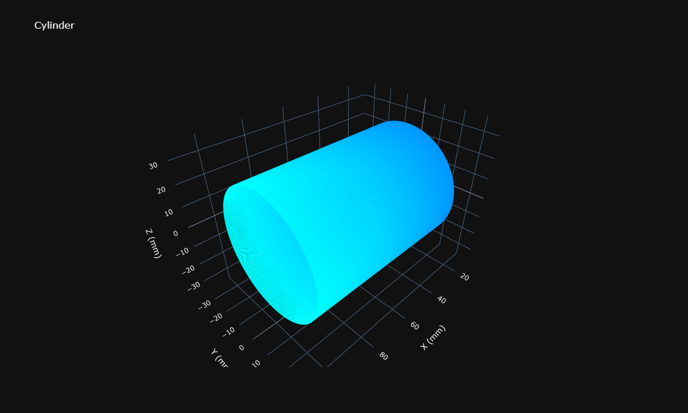
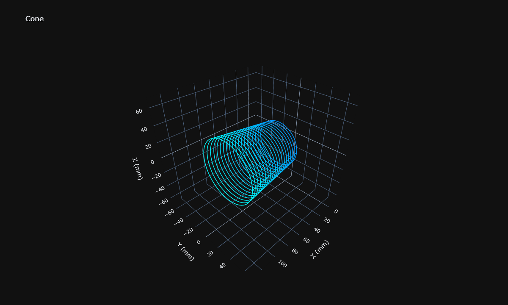
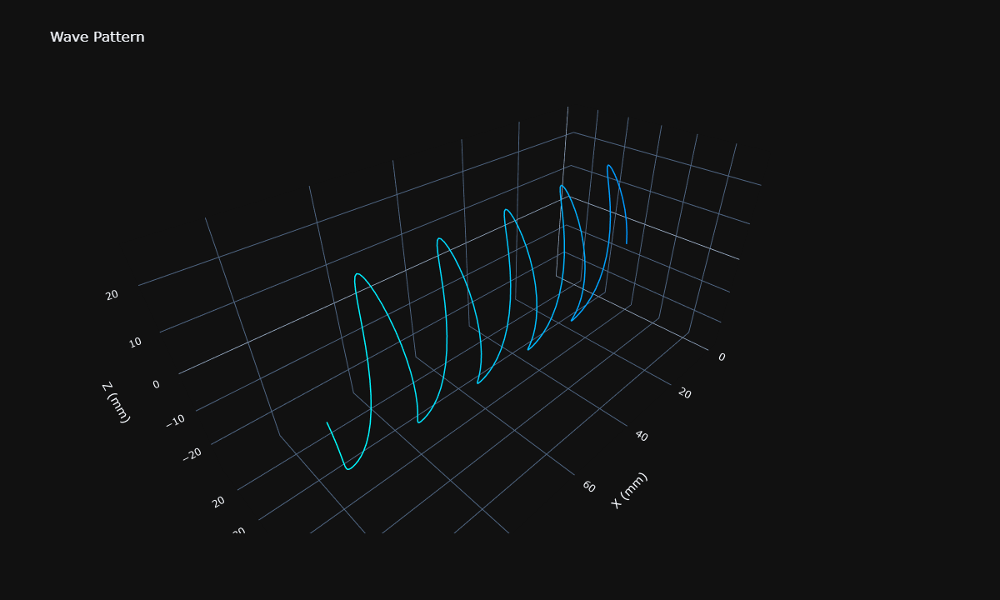
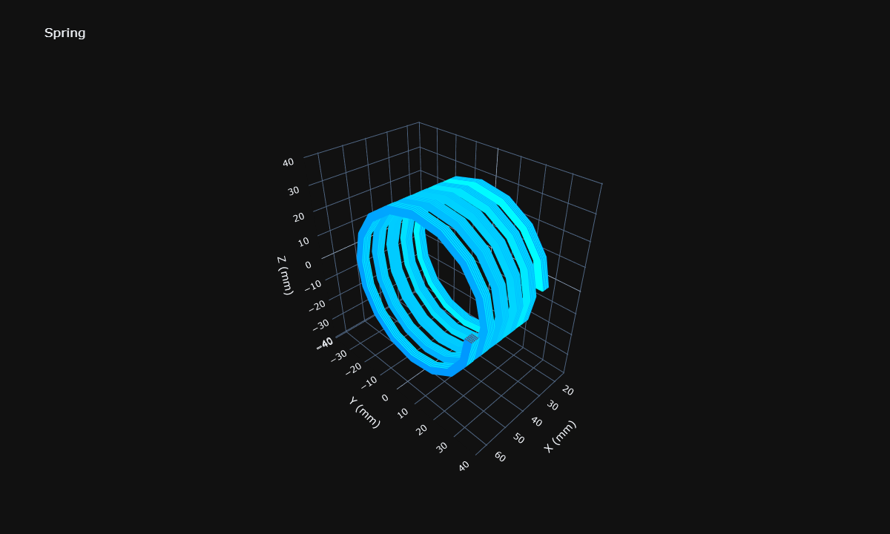
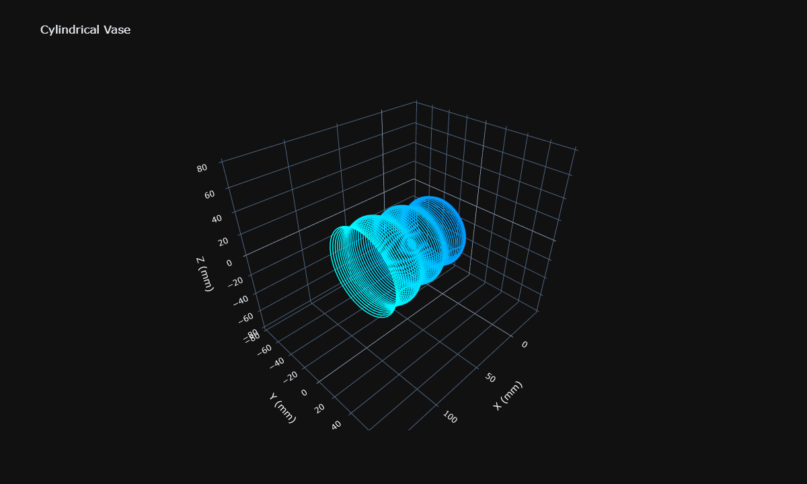
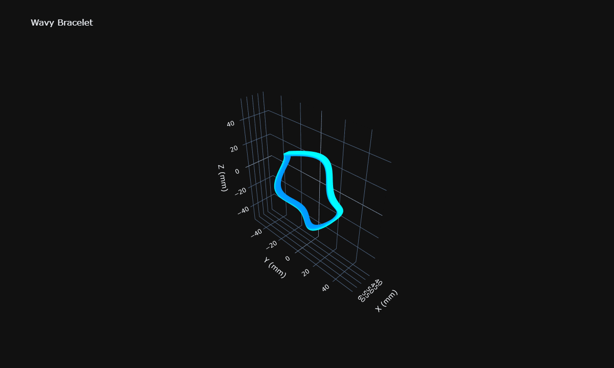

```python
import plotly.io as pio
pio.renderers.default = 'png'
```

# Cylindrical 3D Printer Tutorial

This tutorial demonstrates how to create G-code paths for a printer with lathe geometry.

## Coordinate System

Printer uses a unique coordinate system where:

- **X**: Linear position along the rotation axis (mm)
- **Y**: Rotation angle in degrees (rotates around X-axis)  
- **Z**: Height above the drum surface (mm)
- **E**: Extruder (mm)

## G-code Format
```gcode
G1 X10.000 Y10.0000 Z10.000 E10.00000 F3000
```

## Import FullControl and Cylindrical Functions


```python
import fullcontrol as fc
from fullcontrol.geometry.cylindrical import (
    cylindrical_to_point,
    cylindrical_line,
    cylindrical_arc,
    cylindrical_circle,
    cylindrical_helix,
    cylindrical_spiral,
    cylindrical_wave,
    cylindrical_to_cartesian,
    convert_steps_for_visualization
)
from math import tau, sin, cos
```


```python
import plotly.graph_objects as go
import numpy as np

def plot_cylindrical_with_correct_aspect(viz_steps, title='3D Toolpath', margin_percent=30, zoom=1.0, width=1200, height=720):
    """
    Plot visualization steps with proper cylindrical aspect ratio and margins.
    """

    plot_data = fc.transform(viz_steps, 'plot', fc.PlotControls(raw_data=True))
    fig = go.Figure()
    
    total_print_points = 0
    for path in plot_data.paths:
        if path.extruder.on:
            total_print_points += len(path.xvals)
    
    current_point = 0
    for path in plot_data.paths:
        if path.extruder.on:
            # Printing path - create continuous gradient from blue to cyan
            num_points = len(path.xvals)
            
            if total_print_points > 1 and num_points > 1:
                color_values = []
                for i in range(num_points):
                    progress = (current_point + i) / (total_print_points - 1)
                    color_values.append(progress)
                
                current_point += num_points
                
                fig.add_trace(go.Scatter3d(
                    mode='lines',
                    x=path.xvals,
                    y=path.yvals,
                    z=path.zvals,
                    line=dict(
                        color=color_values,
                        colorscale=[[0, 'rgb(0,150,255)'], [1, 'rgb(0,255,255)']],
                        width=3,
                        showscale=False
                    ),
                    showlegend=False,
                    hoverinfo='skip'
                ))
            else:
                fig.add_trace(go.Scatter3d(
                    mode='lines',
                    x=path.xvals,
                    y=path.yvals,
                    z=path.zvals,
                    line=dict(color='rgb(0,150,255)', width=3),
                    showlegend=False,
                    hoverinfo='skip'
                ))
        else:
            # Travel path - dark red
            fig.add_trace(go.Scatter3d(
                mode='lines',
                x=path.xvals,
                y=path.yvals,
                z=path.zvals,
                line=dict(color='rgb(150,0,0)', width=1),
                showlegend=False,
                hoverinfo='skip'
            ))
    
    # Calculate aspect ratio for cylindrical coordinates
    all_x = [val for path in plot_data.paths if len(path.xvals) > 0 for val in path.xvals]
    all_y = [val for path in plot_data.paths if len(path.yvals) > 0 for val in path.yvals]
    all_z = [val for path in plot_data.paths if len(path.zvals) > 0 for val in path.zvals]
    
    if not all_x or not all_y or not all_z:
        print("Warning: No data to plot")
        return fig
    
    x_range = max(all_x) - min(all_x) if all_x else 1
    y_range = max(all_y) - min(all_y) if all_y else 1
    z_range = max(all_z) - min(all_z) if all_z else 1

    margin = margin_percent / 100.0
    x_range_with_margin = x_range * (1 + margin)
    y_range_with_margin = y_range * (1 + margin)
    z_range_with_margin = z_range * (1 + margin)
    max_yz_range = max(y_range_with_margin, z_range_with_margin)
    
    x_center = (max(all_x) + min(all_x)) / 2
    y_center = (max(all_y) + min(all_y)) / 2
    z_center = (max(all_z) + min(all_z)) / 2
    
    zoom_factor = 1.0 / zoom if zoom > 0 else 1.0
    x_range_zoomed = x_range_with_margin * zoom_factor
    yz_range_zoomed = max_yz_range * zoom_factor
    
    aspect_x = x_range_zoomed / yz_range_zoomed if yz_range_zoomed > 0 else 1
    aspect_y = 1
    aspect_z = 1
    
    fig.update_layout(
        width=width,
        height=height,
        scene=dict(
            aspectmode='manual',
            aspectratio=dict(x=aspect_x, y=aspect_y, z=aspect_z),
            xaxis=dict(
                title='X (mm)', 
                range=[x_center - x_range_zoomed/2, x_center + x_range_zoomed/2]
            ),
            yaxis=dict(
                title='Y (mm)', 
                range=[y_center - yz_range_zoomed/2, y_center + yz_range_zoomed/2]
            ),
            zaxis=dict(
                title='Z (mm)', 
                range=[z_center - yz_range_zoomed/2, z_center + yz_range_zoomed/2]
            ),
        ),
        template='plotly_dark',
        showlegend=False,
        title=title
    )
    
    return fig
```

## Example 1: Simple Circle at Fixed X Position

Create a circle by rotating around the X-axis at a fixed radial distance.


```python
# Printer configuration
DRUM_DIAMETER = 56  #mm
LAYER_HEIGHT = 0.2  #mm
EXTRUSION_WIDTH = 0.4  # mm (nozzle diameter)
FLOW_PERCENT = 100     # %

#Move to starting position
steps = []
steps.append(fc.Extruder(on=False))
steps.append(cylindrical_to_point(x=50, theta_degrees=0, radius=LAYER_HEIGHT))
steps.append(fc.Extruder(on=True))

# Create circle at first layer height
circle_points = cylindrical_circle(x=50, radius=LAYER_HEIGHT, theta_start_degrees=0, segments=64)
steps.extend(circle_points)

# Visualization
viz_steps = convert_steps_for_visualization(steps, drum_diameter=DRUM_DIAMETER)
plot_cylindrical_with_correct_aspect(viz_steps, title='Simple Circle').show()

# Generate G-code
gcode = fc.transform(steps, 'gcode', fc.GcodeControls(
    printer_name='cylindrical',
    save_as='simple_circle',
    initialization_data={
        'drum_radius': DRUM_DIAMETER / 2,
        'extrusion_width': EXTRUSION_WIDTH,
        'extrusion_height': LAYER_HEIGHT,
        'material_flow_percent': FLOW_PERCENT,
        'nozzle_temp': 210,
        'fan_percent': 100,
        'print_speed': 1000
    }
))
```


    

    


## Example 2: Helical Path Along X-Axis

Create a helix by moving along the X-axis while rotating.


```python
# Printer configuration
DRUM_DIAMETER = 56  #mm
LAYER_HEIGHT = 0.2  #mm
EXTRUSION_WIDTH = 0.4  # mm (nozzle diameter)
FLOW_PERCENT = 100     # %

#Move to starting position
steps = []
steps.append(fc.Extruder(on=False))
steps.append(cylindrical_to_point(x=10, theta_degrees=0, radius=LAYER_HEIGHT))
steps.append(fc.Extruder(on=True))

# Create helix
helix_points = cylindrical_helix(
    x_start=10,
    x_end=100,
    radius=LAYER_HEIGHT,
    theta_start_degrees=0,
    turns=5.0,
    segments=200,
    clockwise=False
)
steps.extend(helix_points)

# Visualization
viz_steps = convert_steps_for_visualization(steps, drum_diameter=DRUM_DIAMETER)
plot_cylindrical_with_correct_aspect(viz_steps, title='Helical Path').show()

# Generate G-code
gcode = fc.transform(steps, 'gcode', fc.GcodeControls(
    printer_name='cylindrical',
    save_as='helix',
    initialization_data={
        'drum_radius': DRUM_DIAMETER / 2,
        'extrusion_width': EXTRUSION_WIDTH,
        'extrusion_height': LAYER_HEIGHT,
        'material_flow_percent': FLOW_PERCENT,
        'nozzle_temp': 210,
        'fan_percent': 100,
        'print_speed': 1000
    }
))
```


    

    


## Example 3: Spiral (Varying Radius)

Create a spiral at a fixed X position with changing radius.


```python
# Printer configuration
DRUM_DIAMETER = 56  #mm
LAYER_HEIGHT = 0.2  #mm
EXTRUSION_WIDTH = 0.4  # mm (nozzle diameter)
FLOW_PERCENT = 100     # %

#Move to starting position
steps = []
num_layers = 50
steps.append(fc.Extruder(on=False))
steps.append(cylindrical_to_point(x=50, theta_degrees=0, radius=LAYER_HEIGHT))
steps.append(fc.Extruder(on=True))

# Create spiral
spiral_points = cylindrical_spiral(
    x=50,
    radius_start=LAYER_HEIGHT,
    radius_end=num_layers * LAYER_HEIGHT,
    theta_start_degrees=0,
    turns=3.0,
    segments=150,
    clockwise=False
)
steps.extend(spiral_points)

# Visualization
viz_steps = convert_steps_for_visualization(steps, drum_diameter=DRUM_DIAMETER)
plot_cylindrical_with_correct_aspect(viz_steps, title='Spiral').show()

# Generate G-code
gcode = fc.transform(steps, 'gcode', fc.GcodeControls(
    printer_name='cylindrical',
    save_as='spiral',
    initialization_data={
        'drum_radius': DRUM_DIAMETER / 2,
        'extrusion_width': EXTRUSION_WIDTH,
        'extrusion_height': LAYER_HEIGHT,
        'material_flow_percent': FLOW_PERCENT,
        'nozzle_temp': 210,
        'fan_percent': 100,
        'print_speed': 1000
    }
))
```


    

    


## Example 4: Multiple Circles at Different X Positions (Cylinder)

Create a cylinder by stacking circles along the X-axis.


```python
# Printer configuration
DRUM_DIAMETER = 56  #mm
LAYER_HEIGHT = 0.2  #mm
EXTRUSION_WIDTH = 0.4  # mm (nozzle diameter)
FLOW_PERCENT = 100     # %

# Parameters
x_start = 20
layers = 200
x_spacing = EXTRUSION_WIDTH  # Lines 0.4mm apart

#Move to starting position
steps = []
steps.append(fc.Extruder(on=False))
steps.append(cylindrical_to_point(x=x_start, theta_degrees=0, radius=LAYER_HEIGHT))
steps.append(fc.Extruder(on=True))

# Create cylinder layers - all same diameter, offset in X
current_angle = 0
for layer in range(layers):
    x_pos = x_start + layer * x_spacing
    z_height = LAYER_HEIGHT  # Same radius for all layers
    circle = cylindrical_circle(x=x_pos, radius=z_height, theta_start_degrees=current_angle, segments=64)
    steps.extend(circle)
    current_angle += 360

# Visualization
viz_steps = convert_steps_for_visualization(steps, drum_diameter=DRUM_DIAMETER)
plot_cylindrical_with_correct_aspect(viz_steps, title='Cylinder').show()

# Generate G-code
gcode = fc.transform(steps, 'gcode', fc.GcodeControls(
    printer_name='cylindrical',
    save_as='cylinder',
    initialization_data={
        'drum_radius': DRUM_DIAMETER / 2,
        'extrusion_width': EXTRUSION_WIDTH,
        'extrusion_height': LAYER_HEIGHT,
        'material_flow_percent': FLOW_PERCENT,
        'nozzle_temp': 210,
        'fan_percent': 100,
        'print_speed': 1000
    }
))
```


    

    


## Example 5: Cone (Varying Radius with X Position)


```python
# Printer configuration
DRUM_DIAMETER = 56  #mm
LAYER_HEIGHT = 0.2  #mm
EXTRUSION_WIDTH = 0.4  # mm (nozzle diameter)
FLOW_PERCENT = 100     # %

# Parameters
x_start = 20
x_end = 100
layers = 20
layer_height_x = (x_end - x_start) / layers
z_max = 10

#Move to starting position
steps = []
steps.append(fc.Extruder(on=False))
steps.append(cylindrical_to_point(x=x_start, theta_degrees=0, radius=LAYER_HEIGHT))
steps.append(fc.Extruder(on=True))

# Create cone layers
current_angle = 0
for layer in range(layers):
    t = layer / (layers - 1)
    x_pos = x_start + t * (x_end - x_start)
    z_height = LAYER_HEIGHT + t * (z_max - LAYER_HEIGHT)
    circle = cylindrical_circle(x=x_pos, radius=z_height, theta_start_degrees=current_angle, segments=64)
    steps.extend(circle)
    current_angle += 360

# Visualization
viz_steps = convert_steps_for_visualization(steps, drum_diameter=DRUM_DIAMETER)
plot_cylindrical_with_correct_aspect(viz_steps, title='Cone', zoom=0.7).show()

# Generate G-code
gcode = fc.transform(steps, 'gcode', fc.GcodeControls(
    printer_name='cylindrical',
    save_as='cone',
    initialization_data={
        'drum_radius': DRUM_DIAMETER / 2,
        'extrusion_width': EXTRUSION_WIDTH,
        'extrusion_height': LAYER_HEIGHT,
        'material_flow_percent': FLOW_PERCENT,
        'nozzle_temp': 210,
        'fan_percent': 100,
        'print_speed': 1000
    }
))
```


    

    


## Example 6: Wave Pattern


```python
# Printer configuration
DRUM_DIAMETER = 56  #mm
LAYER_HEIGHT = 0.2  #mm
EXTRUSION_WIDTH = 0.4  # mm (nozzle diameter)
FLOW_PERCENT = 100     # %

#Move to starting position
steps = []
steps.append(fc.Extruder(on=False))
steps.append(cylindrical_to_point(x=10, theta_degrees=0, radius=15, z_offset=0))
steps.append(fc.Extruder(on=True))

# Create wave pattern
wave_points = cylindrical_wave(
    x_start=10,
    x_end=100,
    radius=15,
    theta_start_degrees=0,
    wave_amplitude_degrees=30,
    wave_frequency=5,
    segments=200,
    z_offset=0
)
steps.extend(wave_points)

# Visualization
viz_steps = convert_steps_for_visualization(steps, drum_diameter=DRUM_DIAMETER)
plot_cylindrical_with_correct_aspect(viz_steps, title='Wave Pattern').show()

# Generate G-code
gcode = fc.transform(steps, 'gcode', fc.GcodeControls(
    printer_name='cylindrical',
    save_as='wave',
    initialization_data={
        'drum_radius': DRUM_DIAMETER / 2,
        'extrusion_width': EXTRUSION_WIDTH,
        'extrusion_height': LAYER_HEIGHT,
        'material_flow_percent': FLOW_PERCENT,
        'nozzle_temp': 210,
        'fan_percent': 100,
        'print_speed': 1000
    }
))
```


    

    


## Example 8: Spring (Helix with Increasing Radius)

Create a spring with 10 turns and 10 layers of thickness.

## Advanced: Custom Design Function

Create a reusable function for common cylindrical shapes.


```python
# Printer configuration
DRUM_DIAMETER = 56  #mm
LAYER_HEIGHT = 0.2  #mm
EXTRUSION_WIDTH = 0.4  # mm (nozzle diameter)
FLOW_PERCENT = 100     # %
LINE_OVERLAP_PERCENT = 10  # % overlap between adjacent lines for better adhesion

# Spring parameters
x_start = 20
turns = 5  # Number of complete rotations
wire_layers_wide = 10  # Wire thickness along helix (X direction)
wire_layers_thick = 15  # Wire thickness radially (Z direction) - 15 layers tall

# Layer offset for strength
layer_offset = 0.1  # Offset alternating radial layers by ±0.1mm for better bonding

# Calculate line spacing with overlap
line_spacing = EXTRUSION_WIDTH * (1 - LINE_OVERLAP_PERCENT / 100)  # 0.4 * 0.9 = 0.36mm

# Calculate wire width and pitch
wire_width = (wire_layers_wide - 1) * line_spacing + EXTRUSION_WIDTH  # 9*0.36 + 0.4 = 3.64mm
gap_width = 10 * line_spacing  # 10 * 0.36 = 3.6mm for 4mm equivalent
pitch = wire_width + gap_width  # 3.64 + 3.6 = 7.24mm per turn
x_length = turns * pitch  # 5 * 7.24mm = 36.2mm total length

print(f"Line spacing (with {LINE_OVERLAP_PERCENT}% overlap): {line_spacing:.3f}mm")
print(f"Wire width: {wire_width:.3f}mm")
print(f"Gap width: {gap_width:.3f}mm")
print(f"Pitch per turn: {pitch:.3f}mm")
print(f"Total spring length: {x_length:.3f}mm")
print(f"Wire thickness (radial): {wire_layers_thick * LAYER_HEIGHT:.1f}mm")
print(f"Layer offset: ±{layer_offset}mm for alternating radial layers (brick pattern)")

steps = []
steps.append(fc.Extruder(on=False))
steps.append(cylindrical_to_point(x=x_start, theta_degrees=0, radius=LAYER_HEIGHT))
steps.append(fc.Extruder(on=True))

# Create spring with alternating helix directions to minimize travel
helix_count = 0
for z_layer in range(wire_layers_thick):
    # Offset alternating radial layers by ±0.1mm for better interlocking (brick pattern)
    x_radial_offset = layer_offset if z_layer % 2 == 1 else -layer_offset
    
    for x_layer in range(wire_layers_wide):
        current_radius = LAYER_HEIGHT + (z_layer * LAYER_HEIGHT)
        x_offset = x_layer * line_spacing + x_radial_offset  # Add brick layer offset
        
        # Alternate direction for each helix to minimize travel moves
        reverse = (helix_count % 2 == 1)
        
        if reverse:
            # Going backwards (right to left)
            helix_start_x = x_start + x_offset + x_length
            helix_end_x = x_start + x_offset
            helix_start_theta = turns * 360
            helix_turns = -turns
        else:
            # Going forwards (left to right)
            helix_start_x = x_start + x_offset
            helix_end_x = x_start + x_offset + x_length
            helix_start_theta = 0
            helix_turns = turns
        
        # Move to start of this pass (only if not the very first pass)
        if helix_count > 0:
            steps.append(fc.Extruder(on=False))
            steps.append(cylindrical_to_point(x=helix_start_x, theta_degrees=helix_start_theta, radius=current_radius))
            steps.append(fc.Extruder(on=True))
        
        # Create helix for this pass
        helix = cylindrical_helix(
            x_start=helix_start_x,
            x_end=helix_end_x,
            radius=current_radius,
            theta_start_degrees=helix_start_theta,
            turns=helix_turns,
            segments=turns * 16,
            clockwise=False
        )
        steps.extend(helix)
        helix_count += 1

# Visualization
viz_steps = convert_steps_for_visualization(steps, drum_diameter=DRUM_DIAMETER)
plot_cylindrical_with_correct_aspect(viz_steps, title='Spring').show()

# Generate G-code
gcode = fc.transform(steps, 'gcode', fc.GcodeControls(
    printer_name='cylindrical',
    save_as='spring',
    initialization_data={
        'drum_radius': DRUM_DIAMETER / 2,
        'extrusion_width': EXTRUSION_WIDTH,
        'extrusion_height': LAYER_HEIGHT,
        'material_flow_percent': FLOW_PERCENT,
        'nozzle_temp': 210,
        'fan_percent': 100,
        'print_speed': 1000
    }
))
```

    Line spacing (with 10% overlap): 0.360mm
    Wire width: 3.640mm
    Gap width: 3.600mm
    Pitch per turn: 7.240mm
    Total spring length: 36.200mm
    Wire thickness (radial): 3.0mm
    Layer offset: ±0.1mm for alternating radial layers (brick pattern)
    


    

    


## Example: Wavy Bracelet

Create a bracelet with a sinusoidal wave pattern around the circumference. Layers stack radially outward from the drum surface.


```python
# Printer configuration
DRUM_DIAMETER = 56  #mm
LAYER_HEIGHT = 0.2  #mm
EXTRUSION_WIDTH = 0.4  # mm (nozzle diameter)
FLOW_PERCENT = 100     # %

def create_cylindrical_vase(x_start, x_end, z_start, z_end, layers, segments_per_layer=64):
    steps = []
    steps.append(fc.Extruder(on=False))
    steps.append(cylindrical_to_point(x=x_start, theta_degrees=0, radius=z_start))
    steps.append(fc.Extruder(on=True))
    
    current_angle = 0
    for layer in range(layers):
        t = layer / (layers - 1) if layers > 1 else 0
        x_pos = x_start + t * (x_end - x_start)
        z_height = z_start + t * (z_end - z_start)
        z_height += 2 * sin(t * tau * 3)
        
        circle = cylindrical_circle(
            x=x_pos,
            radius=z_height,
            theta_start_degrees=current_angle,
            segments=segments_per_layer
        )
        steps.extend(circle)
        current_angle += 360
    
    return steps

# Create vase
vase_steps = create_cylindrical_vase(
    x_start=10,
    x_end=100,
    z_start=LAYER_HEIGHT,
    z_end=10,
    layers=50
)

# Visualization
viz_steps = convert_steps_for_visualization(vase_steps, drum_diameter=DRUM_DIAMETER)
plot_cylindrical_with_correct_aspect(viz_steps, title='Cylindrical Vase', zoom=0.6).show()

# Generate G-code
gcode = fc.transform(vase_steps, 'gcode', fc.GcodeControls(
    printer_name='cylindrical',
    save_as='cylindrical_vase',
    initialization_data={
        'drum_radius': DRUM_DIAMETER / 2,
        'extrusion_width': EXTRUSION_WIDTH,
        'extrusion_height': LAYER_HEIGHT,
        'material_flow_percent': FLOW_PERCENT,
        'nozzle_temp': 210,
        'fan_percent': 100,
        'print_speed': 1000
    }
))
```


    

    


```python
# Printer configuration
DRUM_DIAMETER = 56  #mm
LAYER_HEIGHT = 0.2  #mm
EXTRUSION_WIDTH = 0.4  # mm (nozzle diameter)
FLOW_PERCENT = 100     # %

# Bracelet parameters
x_center = 50  # Center position along X axis
bracelet_width = 5  # Width/thickness of bracelet in mm (along X axis)
num_radial_layers = 10  # Number of layers stacking radially outward

# Wave parameters
wave_amplitude = 5  # How much the bracelet waves along X axis (mm)
wave_frequency = 4  # Number of complete waves around the bracelet

# Layer offset for strength
layer_offset = 0.1  # Offset alternating layers by ±0.1mm for better bonding

# Calculate number of circles needed for bracelet width
num_width_circles = max(1, int(bracelet_width / EXTRUSION_WIDTH))

print(f"Creating bracelet with {num_radial_layers} radial layers")
print(f"Bracelet width: {bracelet_width}mm ({num_width_circles} circles wide)")
print(f"Wave amplitude: {wave_amplitude}mm along X axis")
print(f"Wave frequency: {wave_frequency} waves around circumference")
print(f"Layer offset: ±{layer_offset}mm for alternating layers")
print(f"Alternating circle directions to minimize travel moves")

steps = []
steps.append(fc.Extruder(on=False))
steps.append(cylindrical_to_point(x=x_center, theta_degrees=0, radius=LAYER_HEIGHT))
steps.append(fc.Extruder(on=True))

# Create wavy bracelet - layers stack radially outward
circle_count = 0
for radial_layer in range(num_radial_layers):
    # Radius is CONSTANT for this entire layer - only increases between layers
    current_radius = LAYER_HEIGHT + radial_layer * LAYER_HEIGHT
    
    # Offset alternating layers by ±0.1mm for better interlocking
    x_layer_offset = layer_offset if radial_layer % 2 == 1 else -layer_offset
    
    # Create multiple circles at this radial height to give bracelet width/thickness
    for width_idx in range(num_width_circles):
        # Base X position for this width layer
        x_base = x_center - bracelet_width/2 + width_idx * EXTRUSION_WIDTH + x_layer_offset
        
        # Alternate direction for each circle to minimize travel moves
        reverse = (circle_count % 2 == 1)
        
        # Create a circle at this radius and X position, varying X to create wave
        segments = 128  # High resolution for smooth waves
        
        for i in range(segments + 1):
            if reverse:
                # Go backwards (360 to 0)
                theta = 360 - (360 * i / segments)
            else:
                # Go forwards (0 to 360)
                theta = (360 * i / segments)
            
            theta_rad = theta * (tau / 360)
            
            # Vary X position sinusoidally as we go around - this creates the wave!
            x_variation = wave_amplitude * sin(wave_frequency * theta_rad)
            x_pos = x_base + x_variation
            
            point = cylindrical_to_point(x=x_pos, theta_degrees=theta, radius=current_radius)
            steps.append(point)
        
        circle_count += 1

# Visualization
viz_steps = convert_steps_for_visualization(steps, drum_diameter=DRUM_DIAMETER)
plot_cylindrical_with_correct_aspect(viz_steps, title='Wavy Bracelet', zoom=0.7).show()

# Generate G-code
gcode = fc.transform(steps, 'gcode', fc.GcodeControls(
    printer_name='cylindrical',
    save_as='wavy_bracelet',
    initialization_data={
        'drum_radius': DRUM_DIAMETER / 2,
        'extrusion_width': EXTRUSION_WIDTH,
        'extrusion_height': LAYER_HEIGHT,
        'material_flow_percent': FLOW_PERCENT,
        'nozzle_temp': 210,
        'fan_percent': 100,
        'print_speed': 1000
    }
))
```

    Creating bracelet with 10 radial layers
    Bracelet width: 5mm (12 circles wide)
    Wave amplitude: 5mm along X axis
    Wave frequency: 4 waves around circumference
    Layer offset: ±0.1mm for alternating layers
    Alternating circle directions to minimize travel moves
    


    

    

