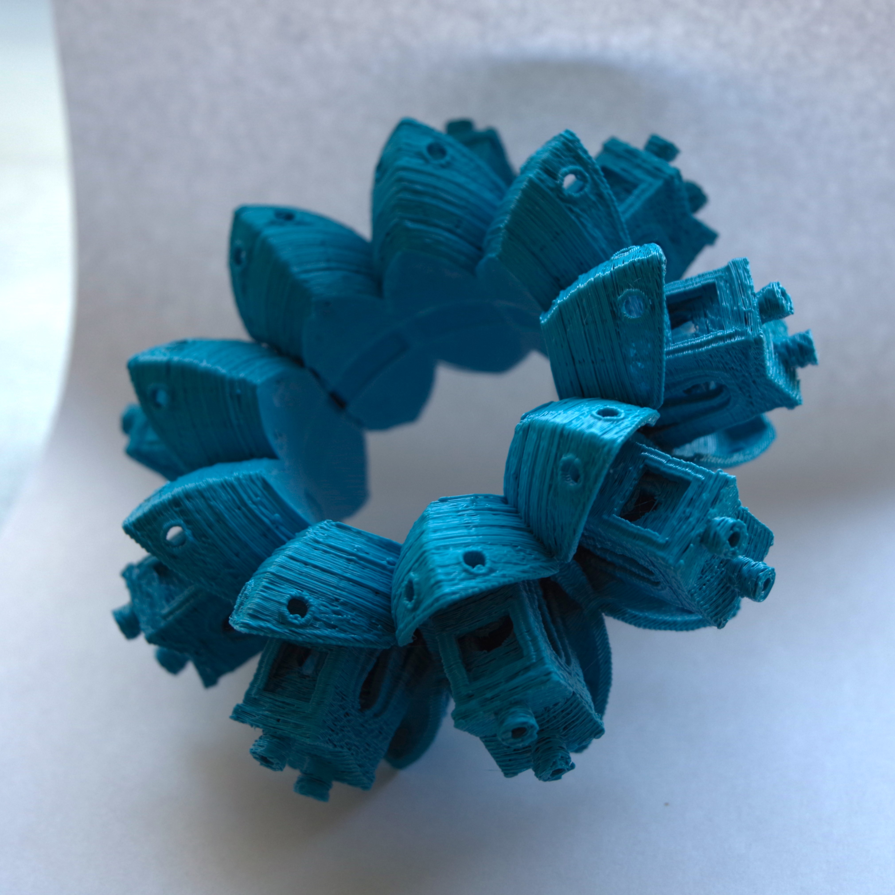
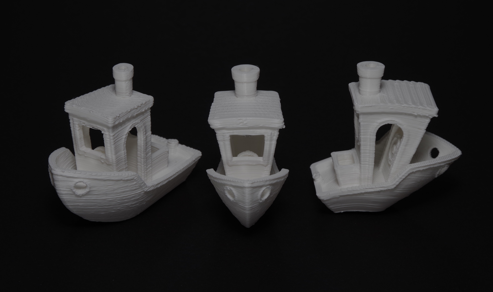
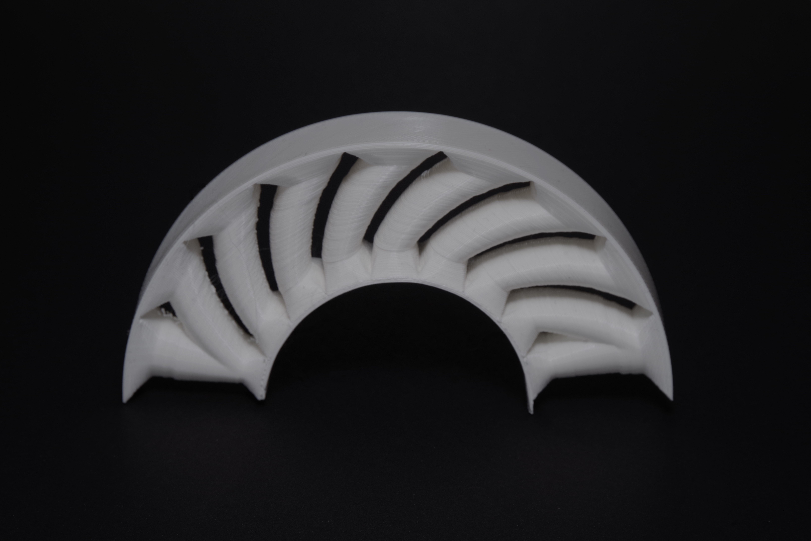
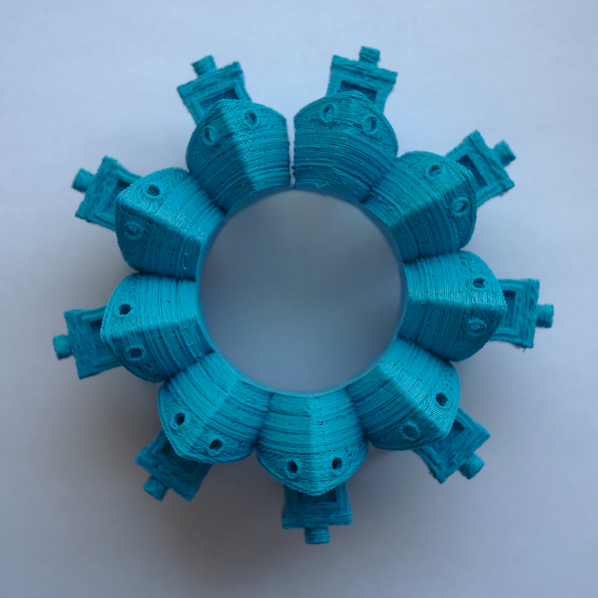

Yes, I had a nozzle clog while printing this...

# Cylindrical 3D Printer

An open-source cylindrical (polar) 3D printer built from raw components and 3D printed parts. Instead of a flat print bed, the model is deposited onto a rotating drum — enabling geometries that are impossible or impractical on a standard Cartesian FDM printer, such as seamless cylindrical shells and radially symmetric structures.

The printer runs **Marlin 2.1** with POLAR kinematics on a **BTT SKR V1.4 Turbo** board. Two independent methods for generating G-code are provided: a slicer-based workflow using Cura with geometric pre/post-processing, and a fully algorithmic approach using a [custom fork of FullControl XYZ](https://github.com/Siedmiu/fullcontrol_Cylindrical).

> **This project is no longer actively developed.** The repository is open for anyone to build on — contributions, forks, and pull requests are very welcome. Happy to answer questions via GitHub Issues.

---

## Gallery

A 3DBenchy printed on the cylindrical printer. The model was adapted to wrap around the drum surface and sliced using the Cura-based workflow.

*Three 3DBenchy prints: one with corrected distortion and two with different axes of cylindrical distortion, illustrating the effect of the coordinate transformation.*

*An arch printed directly on the drum — a geometry that cannot be printed without supports on a standard FDM printer, printed here support-free by leveraging the cylindrical build surface.*

### First Print Timelapse

---

## Repository Structure

### [`Marlin config/`](Marlin%20config/)
Marlin 2.1.2.5 firmware configuration for BTT SKR V1.4 Turbo with TMC2208 drivers and POLAR kinematics. Includes a full README with a table of all key changes from stock defaults.

### [`Cura Slicer to cylindrical conversion/`](Cura%20Slicer%20to%20cylindrical%20conversion/)
The primary recommended G-code generation method. A full workflow README describes each step:
1. Prepare and cut the model to fit the drum
2. Flatten the STL from cylindrical to Cartesian geometry (`cylindrical_to_cartesian.py`)
3. Slice in Cura using the included **Custom Cylindrical** printer profile
4. Correct extrusion values for arc paths (`recalculate_extrusion.py`)

Sample files for each step and a propeller example (geometry designed natively for cylindrical printing) are included.

### [`FullcontrollXYZ preview/`](FullcontrollXYZ%20preview/)
An experimental alternative using a [custom fork of FullControl XYZ](https://github.com/Siedmiu/fullcontrol_Cylindrical) to generate toolpaths natively in cylindrical coordinates. Work in progress — the Cura-based method is recommended for most use cases. Includes a rendered preview of results.

### [`Cad Files/`](Cad%20Files/)
STEP file for the complete printer assembly. Compatible with Fusion 360, FreeCAD, SolidWorks, and most other CAD tools.

### [`docs/`](docs/)
Wiring diagram for the BTT SKR V1.4 Turbo board.

### [`diploma/`](diploma/)
Background reading: the original thesis (Polish) with an English translation and an AI-generated abstract covering the design decisions, kinematics, and path generation methods in depth.

### [`gallery/`](gallery/)
Photos and a timelapse of the printer and its prints.

---

## License

[GPL-3.0](LICENSE)

---

